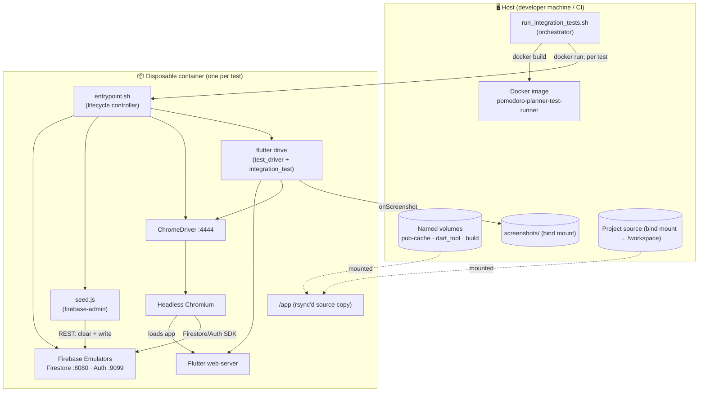
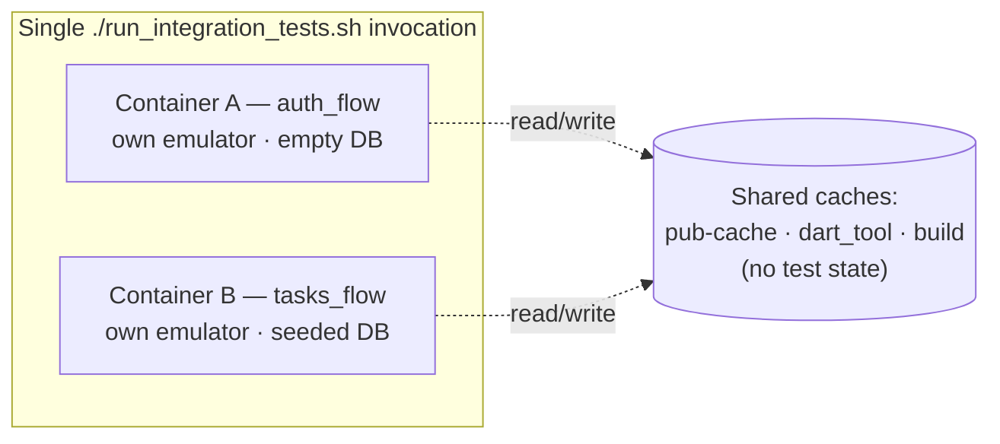
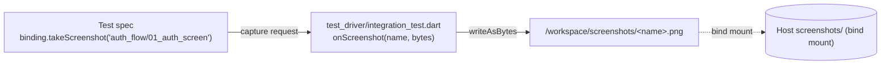

# End-to-End Integration Testing — Architecture

This document describes the architecture of the **sandboxed end-to-end (E2E) integration
testing system** for Pomodoro Planner. It is the flagship quality system of this project:
every E2E test runs the **real Flutter web app** against a **real Firebase backend** (the
official Firebase Emulator Suite), inside a **disposable, hermetic Docker container**, with
**deterministic seed data** and **screenshot evidence** captured at every meaningful step.

> TL;DR — One command (`./run_integration_tests.sh`) builds a toolchain image, then for each
> test spins up an isolated container that boots the Firebase emulators, wipes + seeds the
> database, serves the Flutter web build, drives it through headless Chromium, and writes
> step-by-step screenshots back to the host.

---

## Table of contents

1. [Goals & design principles](#goals--design-principles)
2. [System overview](#system-overview)
3. [Component reference](#component-reference)
4. [Execution lifecycle](#execution-lifecycle)
5. [Test isolation model](#test-isolation-model)
6. [Data seeding model](#data-seeding-model)
7. [App ⇄ emulator wiring](#app--emulator-wiring)
8. [Screenshot artifact pipeline](#screenshot-artifact-pipeline)
9. [How to run](#how-to-run)
10. [How to add a new E2E test](#how-to-add-a-new-e2e-test)
11. [Configuration reference](#configuration-reference)
12. [Determinism, sharp edges & future work](#determinism-sharp-edges--future-work)

---

## Goals & design principles

| Principle | What it means here |
|-----------|--------------------|
| **True end-to-end** | Tests exercise the production code path — the real `main()`, real BLoCs, real `cloud_firestore`/`firebase_auth` SDKs — not mocks or fakes. Only the *backend endpoint* is swapped for the emulator. |
| **Hermetic & reproducible** | All tooling (Flutter, Dart, JDK 21, Node 20, Chromium, ChromeDriver, Firebase CLI) is pinned inside a Docker image. A run does not depend on whatever is installed on the host beyond Docker itself. |
| **Isolated per test** | Each test runs in its own `--rm` container with its own emulator instance and its own freshly-seeded database. Tests cannot leak state into one another. |
| **Deterministic data** | The database is **cleared and re-seeded** before every test from a declarative JSON fixture. A `{TODAY}` template keeps date-sensitive fixtures valid on any calendar day. |
| **No production blast radius** | Tests never touch the real Firebase project. The app is pointed at `localhost` emulators via compile-time `--dart-define` flags. |
| **Evidence by default** | Every test captures PNG screenshots at key UI states, written back to the host `screenshots/` directory for human/CI inspection. |
| **Fast iteration** | Pub cache, `.dart_tool`, and `build/` are persisted in named Docker volumes, so repeated runs skip re-downloading packages and reuse incremental build artifacts. |

---

## System overview

The system has two execution planes: a thin **host orchestrator** and a fat **per-test
container** that contains the entire test stack.



### Files that make up the system

```
.
├── run_integration_tests.sh              # Host orchestrator (build → run → report)
├── lib/main.dart                         # App: --dart-define emulator wiring (USE_EMULATOR)
├── test_driver/
│   └── integration_test.dart             # Driver: screenshot sink (writes PNGs to host)
├── integration_test/                     # The test specs (what the user does)
│   ├── auth_flow_test.dart               #   Sign-up → land on home
│   └── tasks_flow_test.dart              #   Sign-in → see seeded tasks → complete → create
├── integration_test_system/             # The sandbox + backend tooling
│   ├── Dockerfile                        #   Pinned toolchain image
│   ├── entrypoint.sh                     #   In-container lifecycle controller
│   ├── firebase.json                     #   Emulator ports/hosts (NOT the app's firebase.json)
│   ├── package.json                      #   Seeder deps (firebase-admin)
│   ├── seed.js                           #   Clears + seeds Auth & Firestore from JSON
│   └── seeds/
│       ├── auth_flow.json                #   Empty DB fixture
│       └── tasks_flow.json               #   Seeded user + two tasks
└── screenshots/                          # Output: captured PNGs (per test, per step)
```

---

## Component reference

### 1. Host orchestrator — `run_integration_tests.sh`

The only entry point a developer/CI invokes. Responsibilities:

1. **Build the image** `pomodoro-planner-test-runner` from `integration_test_system/Dockerfile`.
2. **Ensure cache volumes** exist (`pomodoro-pub-cache`, `pomodoro-build-cache`, `pomodoro-build`).
3. **Reset** the host `screenshots/` directory.
4. Iterate a declarative **test matrix** — each entry is a `test_file|seed_file` pair:
   ```bash
   declare -a TESTS=(
     "integration_test/auth_flow_test.dart|integration_test_system/seeds/auth_flow.json"
     "integration_test/tasks_flow_test.dart|integration_test_system/seeds/tasks_flow.json"
   )
   ```
5. For each entry, **`docker run --rm`** a fresh container with:
   - the project root bind-mounted at `/workspace`,
   - the three cache volumes mounted at their build paths,
   - `TEST_TARGET` and `SEED_FILE` passed as env vars,
   - the container command set to `/workspace/integration_test_system/entrypoint.sh`.
6. **Collect pass/fail** per test and print a final report (listing captured screenshots).
   Exits non-zero if **any** test fails — the signal CI keys off.

> Tests run **sequentially**, each in a clean container. Adding a test = adding one line to
> the `TESTS` array plus its seed file.

### 2. Toolchain image — `integration_test_system/Dockerfile`

A `debian:bookworm-slim` base baked with everything a web E2E run needs, so containers start
ready-to-go:

- **Java 21** (Temurin) — required by the Firestore emulator.
- **Node.js 20** + **`firebase-tools`** (global) — runs the emulators and the seeder.
- **Chromium + chromium-driver** — the browser and WebDriver that drive the web app
  (`CHROME_EXECUTABLE=/usr/bin/chromium`).
- **Flutter SDK (stable)** at `/opt/flutter`, with web enabled (`flutter config --enable-web`).
- **`rsync`** — used to copy source into an isolated build dir at runtime.
- Firestore emulator binaries are **pre-downloaded at build time**
  (`firebase setup:emulators:firestore`) to avoid a first-run download timeout.

Baking the toolchain (vs. installing at runtime) is what makes runs both **hermetic** and
**fast on warm caches**.

### 3. In-container lifecycle controller — `integration_test_system/entrypoint.sh`

Runs *inside* each container and choreographs the whole test. See
[Execution lifecycle](#execution-lifecycle) for the step-by-step.

### 4. Emulator config — `integration_test_system/firebase.json`

> ⚠️ Distinct from the repo-root `firebase.json` (which is FlutterFire's app config). This one
> only configures the **emulator suite**.

```json
{
  "emulators": {
    "auth":      { "port": 9099, "host": "0.0.0.0" },
    "firestore": { "port": 8080, "host": "0.0.0.0" },
    "singleProjectMode": true
  }
}
```

Binding to `0.0.0.0` lets both the seeder (`127.0.0.1`) and the Flutter app (`localhost`)
reach the emulators inside the container.

### 5. Seeder — `seed.js` + `seeds/*.json`

A Node script using **`firebase-admin`** that, before each test, **clears** the emulator
state (Firestore documents + Auth accounts via the emulator REST API) and then **writes** the
fixture. See [Data seeding model](#data-seeding-model).

### 6. Test driver — `test_driver/integration_test.dart`

The `flutter drive` driver half. Its job is to provide an **`onScreenshot` sink** that writes
captured bytes to `/workspace/screenshots/<name>.png` (falling back to `./screenshots` if not
mounted). Because `/workspace` is a bind mount, screenshots land on the host automatically.

### 7. Test specs — `integration_test/*.dart`

The `flutter drive` target half — real `WidgetTester` flows that boot the app via
`app.main()` and act as a user would. Current coverage:

| Spec | Seed | Flow |
|------|------|------|
| `auth_flow_test.dart` | `auth_flow.json` (empty) | Open app → toggle to Sign Up → register a **unique** email → assert navigation to Home. Screenshots `01–03`. |
| `tasks_flow_test.dart` | `tasks_flow.json` (1 user, 2 tasks) | Sign in as seeded user → assert both seeded tasks visible → complete the incomplete one → create "New E2E Task" via FAB → assert it appears. Screenshots `01–04`. |

---

## Execution lifecycle

What happens for **one** test, from `docker run` to exit code. `entrypoint.sh` drives steps
3–10:

```mermaid
sequenceDiagram
    autonumber
    participant Orch as run_integration_tests.sh (host)
    participant Cnt as Container / entrypoint.sh
    participant Emu as Firebase Emulators
    participant Seed as seed.js
    participant CD as ChromeDriver + Chromium
    participant App as Flutter web app

    Orch->>Cnt: docker run (TEST_TARGET, SEED_FILE, mounts)
    Cnt->>Cnt: rsync /workspace → /app (exclude .git, build, native dirs)
    Cnt->>Cnt: npm install (firebase-admin) in seeder dir
    Cnt->>Emu: firebase emulators:start (bg) + trap cleanup on EXIT
    Cnt->>Emu: poll :8080 and :9099 until healthy (60s each)
    Cnt->>Seed: node seed.js $SEED_FILE
    Seed->>Emu: DELETE all Firestore docs + Auth accounts
    Seed->>Emu: create seeded users + write Firestore docs ({TODAY} resolved)
    Cnt->>CD: start chromedriver :4444
    Cnt->>App: flutter drive (web-server, headless, --dart-define USE_EMULATOR=true)
    App->>Emu: Auth + Firestore traffic via localhost
    App-->>CD: render UI; driver pumps & asserts
    App->>Orch: onScreenshot → write PNG to /workspace/screenshots
    Cnt-->>Orch: exit code (0 pass / non-zero fail); cleanup kills emulator + chromedriver
    Orch->>Orch: record PASS/FAIL, print report
```

Concretely, `entrypoint.sh`:

1. **Isolates the build** — `rsync`'s `/workspace` → `/app`, excluding `.git`, `.github`,
   `.dart_tool`, `build`, and all native platform dirs (`android`, `ios`, `macos`, `linux`,
   `windows`). Only the web target is needed, so native folders are dropped for speed.
2. **Installs seeder deps** — `npm install` in `integration_test_system/`.
3. **Starts the emulators** in the background and installs an `EXIT` trap that kills the
   emulator and ChromeDriver on any exit path (success, failure, or error).
4. **Waits for health** — curl-polls `:8080` (Firestore) and `:9099` (Auth), 60s timeout each.
5. **Seeds** — `node seed.js $SEED_FILE` (clears, then writes the fixture).
6. **Starts ChromeDriver** on `:4444`.
7. **Runs the test** — `flutter drive` with the web-server device, headless Chromium flags,
   and `--dart-define=USE_EMULATOR=true --dart-define=EMULATOR_HOST=localhost`.
8. **Exits** with the test's exit code; the trap tears everything down.

---

## Test isolation model

Isolation is enforced at three layers:

- **Process/OS layer** — each test gets a brand-new `--rm` container; nothing survives.
- **Backend layer** — each container runs its **own** emulator instance, and the seeder
  **wipes** Firestore + Auth before writing the fixture, so even shared state within a run is
  impossible.
- **Build layer** — source is `rsync`'d into `/app` rather than built in the mounted
  `/workspace`, so build artifacts don't pollute the host working tree.

The only things intentionally **shared across runs** are the three cache volumes (pub cache,
`.dart_tool`, `build`). These hold no *test* state — only package downloads and incremental
compilation outputs — so sharing them is safe and dramatically speeds up warm runs.



---

## Data seeding model

Fixtures are declarative JSON with two top-level keys, `auth` and `firestore`:

```jsonc
{
  "auth": [
    { "uid": "test-user-1", "email": "user@example.com", "password": "password123" }
  ],
  "firestore": {
    // key = full Firestore document path, value = document fields
    "users/test-user-1/tasks/task-1": {
      "id": "task-1",
      "title": "Incomplete Seed Task",
      "description": "This is a seeded uncompleted task",
      "priorityIndex": 2,
      "isCompleted": false,
      "recurrencePattern": "none",
      "scheduledDate": "{TODAY}T10:00:00.000Z",
      "subtasks": []
    }
  }
}
```

**How `seed.js` processes it:**

1. **Clear first, always** — `DELETE`s every Firestore document and Auth account through the
   emulator REST endpoints, guaranteeing a known-empty starting point.
2. **Auth** — for each entry in `auth[]`, `admin.auth().createUser({uid, email, password})`.
   Using a **fixed `uid`** is what lets Firestore docs be pre-written under that user's
   subcollection.
3. **Firestore** — for each `"<doc path>": { ...fields }` pair, `db.doc(path).set(fields)`.
4. **`{TODAY}` templating** — any string field containing `{TODAY}` has it replaced with the
   current date (`YYYY-MM-DD`). This is essential: the app's task list filters by
   `scheduledDate == selected day` (today), so date-bound fixtures must always resolve to the
   current day to remain visible.

**Fixture ⇄ app data model.** Seed field names are written at the **Firestore document level**
and must match what the app's `TaskModel.fromMap` expects (`lib/features/tasks/data/models/task_model.dart`):

| Seed field | App model field | Notes |
|------------|-----------------|-------|
| `priorityIndex` | `TaskPriority.values[index]` | `0=low, 1=medium, 2=high` |
| `scheduledDate` | `DateTime.parse(...)` | ISO-8601 string; drives the "today" filter |
| `isCompleted` | `bool` | defaults to `false` if absent |
| `subtasks` | `List<SubtaskModel>` | array of `{id, title, isCompleted}` |
| `recurrencePattern` | `String` | `none` / `daily` / `weekly` |
| `category`, `startTime`, `endTime`, `completedAt` | optional | omitted ⇒ null/defaults |

Documents live under `users/{uid}/tasks/{taskId}`, mirroring
`FirestoreTasksRepository` which scopes all reads/writes to
`users/{userId}/tasks`.

---

## App ⇄ emulator wiring

The app opts into the emulators **only** when explicitly told to, via compile-time flags read
in `lib/main.dart`:

```dart
const useEmulator = bool.fromEnvironment('USE_EMULATOR', defaultValue: false);
if (useEmulator) {
  const host = String.fromEnvironment('EMULATOR_HOST', defaultValue: 'localhost');
  FirebaseFirestore.instance.useFirestoreEmulator(host, 8080);
  await FirebaseAuth.instance.useAuthEmulator(host, 9099);
  // ...also forwards Flutter/platform errors to stdout (E2E_FLUTTER_ERROR / E2E_PLATFORM_ERROR)
}
```

- `USE_EMULATOR` defaults to `false`, so **production builds never connect to an emulator** —
  the test path is strictly opt-in and cannot be triggered by accident.
- When enabled, the app also pipes uncaught Flutter/platform errors to stdout, which surfaces
  in the `flutter drive` logs for debugging failed runs.
- The same `firebase_options.dart`/project id (`task-planner-c03ea`) is used; only the
  *endpoint* is redirected to `localhost`.

---

## Screenshot artifact pipeline



- Test specs call `binding.takeScreenshot('<group>/<step>')` at meaningful UI states.
- The driver's `onScreenshot` handler writes the PNG under `/workspace/screenshots/`, which is
  the host's `screenshots/` directory via bind mount — so artifacts are available the instant
  the container exits.
- The orchestrator lists captured screenshots per test in its final report. Naming convention
  is `<flow>/<NN_step_name>.png` (e.g. `tasks_flow/02_task_completed.png`).

---

## How to run

Prerequisites: **Docker** (Desktop or engine). Nothing else — the toolchain is in the image.

```bash
# From the repo root:
./run_integration_tests.sh
```

First run builds the image and downloads the Flutter/pub/emulator caches (slow). Subsequent
runs reuse the image and the named volumes (fast). Results print as a PASS/FAIL report and
screenshots appear under `screenshots/`.

---

## How to add a new E2E test

1. **Write the spec** in `integration_test/<feature>_flow_test.dart` (boot via `app.main()`,
   drive with `WidgetTester`, capture screenshots at key states).
2. **Create a seed fixture** in `integration_test_system/seeds/<feature>_flow.json`
   (use `{TODAY}` for any date-bound documents; match `TaskModel`/Firestore field names).
3. **Register it** in the `TESTS` array in `run_integration_tests.sh`:
   ```bash
   "integration_test/<feature>_flow_test.dart|integration_test_system/seeds/<feature>_flow.json"
   ```
4. Run `./run_integration_tests.sh`. The new test gets its own isolated, seeded container.

---

## Configuration reference

| Item | Value | Defined in |
|------|-------|------------|
| Firebase project id | `task-planner-c03ea` | `firebase_options.dart`, `seed.js`, `entrypoint.sh` |
| Firestore emulator | `:8080` (host `0.0.0.0`) | `integration_test_system/firebase.json` |
| Auth emulator | `:9099` (host `0.0.0.0`) | `integration_test_system/firebase.json` |
| ChromeDriver | `:4444` (`--whitelisted-ips=127.0.0.1`) | `entrypoint.sh` |
| App emulator switch | `--dart-define=USE_EMULATOR=true` | `entrypoint.sh` → `main.dart` |
| App emulator host | `--dart-define=EMULATOR_HOST=localhost` | `entrypoint.sh` → `main.dart` |
| Docker image | `pomodoro-planner-test-runner` | `run_integration_tests.sh` |
| Cache volumes | `pomodoro-pub-cache` → `/root/.pub-cache`<br/>`pomodoro-build-cache` → `/app/.dart_tool`<br/>`pomodoro-build` → `/app/build` | `run_integration_tests.sh` |
| Container env in | `TEST_TARGET`, `SEED_FILE` | `run_integration_tests.sh` → `entrypoint.sh` |
| Toolchain | Debian bookworm · JDK 21 · Node 20 · Chromium + driver · Flutter stable | `Dockerfile` |

---

## Determinism, sharp edges & future work

The system is strong on isolation and reproducibility, but a few areas are worth knowing about
and improving:

- **Time-based waits in specs.** Tests currently advance with fixed pump loops (e.g.
  `for (i in 0..10) pump(1s)`) to wait out async Firebase operations. This is the main source
  of potential flakiness/slowness. **Improvement:** poll for a target widget/condition
  (pump-until-found) instead of fixed durations.
- **Web-only.** `entrypoint.sh` excludes native platform dirs and runs against
  `-d web-server` + headless Chromium. Mobile E2E (emulator/simulator) is not covered by this
  system. **Improvement:** add Android/iOS lanes if mobile-specific behavior needs coverage.
- **No security-rules coverage.** The emulator runs without a `firestore.rules` file, so it is
  effectively open. These tests validate app behavior, **not** Firestore security rules.
  **Improvement:** add a rules file + a dedicated rules test suite (the emulator supports this).
- **Sequential execution.** Tests run one container at a time. **Improvement:** parallelize
  across containers (each is already fully isolated) to cut wall-clock time.
- **`set -e` + exit-code capture.** In `entrypoint.sh`, a failing `flutter drive` under
  `set -e` terminates the script before the explicit `FAILURE` log line; the non-zero exit code
  still propagates correctly (the orchestrator wraps `docker run` in `set +e`), so reporting is
  accurate — but the in-container "FAILURE:" message may not print. Minor, cosmetic.
- **Committed screenshots.** `screenshots/` is version-controlled, capturing a visual baseline.
  If this grows noisy, consider treating them as CI artifacts instead of committed files.
```
