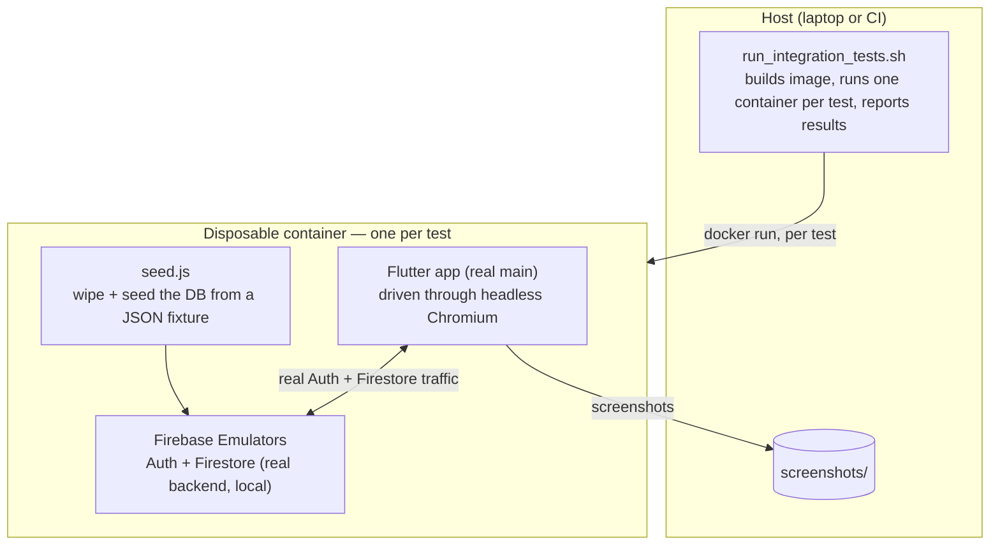
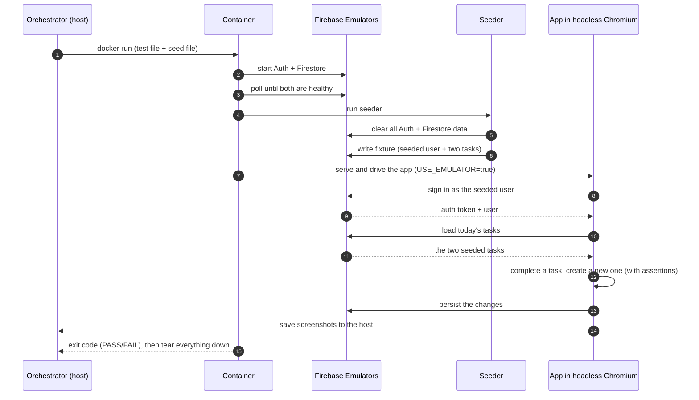

# End-to-End Integration Testing Against a Real Backend

## The problem

I wanted confidence that the app works as a whole — not just that individual widgets or
functions behave in isolation, but that a real user flow succeeds when the **actual app talks
to an actual backend**: sign up, read and write Firestore data, complete a task, and see the
result reflected in the UI.

Unit and widget tests can't give that confidence, because they mock the backend away. The hard
part of this feature is exactly the part mocks remove: real authentication, real Firestore
queries, real async timing, and the real serialization/deserialization between the app and the
database.

So the goal was a test system that:

- drives the **real application** end to end (the real `main()`, real BLoCs, real Firebase SDKs),
- runs against a **real backend** rather than mocks,
- is **deterministic** (same result every run) and **isolated** (tests can't interfere),
- never touches the **production** Firebase project, and
- is **reproducible** on any machine and in CI, not just "works on my laptop."

## The approach in one sentence

Run the real Flutter app against Google's **Firebase Emulator Suite** (a genuine
Auth + Firestore backend, just local), inside a **disposable Docker container**, with the
database **wiped and seeded** before each test, and capture **screenshots** of every key
screen as evidence.

The emulator is the key choice: it's the *real* Firebase implementation running locally, so
the app's Firebase code runs unchanged — but it's safe, free, fast, and resettable.

## Key design decisions

This is the part I care about most, because each decision has a reason and a trade-off.

**1. A real backend (emulator), not mocks.**
Mocking Firebase would only test my mocks. The emulator runs the same Auth and Firestore
behavior as production, so the test exercises real queries, real auth tokens, and the real data
mapping layer. The app doesn't know it's talking to an emulator — I redirect it at runtime (see
decision 4).

**2. Everything runs inside Docker.**
The test stack needs Flutter, a JDK, Node, the Firebase CLI, Chromium, and ChromeDriver — a lot
to ask every developer (and CI) to install at exact versions. Baking it all into one image makes
runs **hermetic and reproducible**: a run depends on nothing but Docker. The trade-off is a heavy
first build, which I offset by caching (decision 6).

**3. The database is cleared and re-seeded before every test.**
Determinism comes from controlling the starting state. Before each test, a small Node seeder
wipes Auth + Firestore and writes a known fixture from a JSON file. A test that expects "two
tasks for today" always finds exactly those two — never leftovers from a previous run.

**4. The app opts into the emulator at compile time, so production is safe.**
`main.dart` only connects to the emulator when built with `--dart-define=USE_EMULATOR=true`.
It defaults to `false`, so a normal/production build can never accidentally point at a test
backend. This keeps the test wiring in the real code path without risking the real project.

**5. Each test gets its own fresh container.**
Isolation is enforced at the strongest level: every test runs in its own `--rm` container with
its own emulator. There's no shared server to leak state, so tests can't affect each other and
can (later) run in parallel safely.

**6. Shared caches for speed.**
The only things reused across runs are Docker volumes for the pub cache and build artifacts —
no test state, just downloads and incremental compilation. This turns a cold multi-minute run
into a fast warm one.

**7. Screenshots as evidence.**
At each meaningful step the test captures a screenshot, written back to the host. This makes a
pass/fail tangible and a failure debuggable — you can *see* exactly what the app looked like
when something went wrong.

## Architecture at a glance



The pieces:

- **`run_integration_tests.sh`** — the one command you run. Builds the image and, for each entry
  in a small test list (`test file | seed file`), launches an isolated container and collects
  pass/fail.
- **`Dockerfile`** — the pinned toolchain (Flutter, JDK 21, Node 20, Firebase CLI, Chromium).
- **`entrypoint.sh`** — runs inside the container and orchestrates one test: start emulators →
  seed → serve the app → drive it → report exit code.
- **Firebase Emulator Suite** — the real Auth + Firestore backend, running locally.
- **`seed.js` + `seeds/*.json`** — the deterministic data layer: clear, then load a fixture.
- **`integration_test/*.dart`** — the test flows themselves (what the user does).
- **`test_driver/integration_test.dart`** — saves captured screenshots to the host.

## What happens in one test run

This is the full lifecycle of a single test — using the tasks flow as a concrete example:



Step by step:

1. The orchestrator launches a fresh container for the test, mounting the project in.
2. Inside, the Firebase emulators start and we wait until Auth and Firestore are healthy.
3. The seeder **clears** the emulator, then writes the test's JSON fixture (users + documents).
4. The Flutter app is served and driven through headless Chromium, built with
   `USE_EMULATOR=true` so it talks to the local emulators.
5. The test acts as a user (sign in, tap, type, assert) and captures screenshots along the way.
6. The container exits with the test's result and tears everything down; the orchestrator records
   PASS/FAIL and lists the screenshots.

## What the tests actually verify

- **Auth flow** — open the app, switch to Sign Up, register a brand-new account, and confirm the
  app navigates into the home screen. (Starts from an empty database.)
- **Tasks flow** — sign in as a seeded user, confirm the two seeded tasks render, mark the
  incomplete one done, create a new task, and confirm it appears in the list. (Starts from a
  seeded database, so the assertions are exact.)

A nice detail: task fixtures use a `{TODAY}` placeholder that the seeder replaces with the
current date, because the app shows "today's" tasks — so date-bound fixtures stay valid on any
day the suite runs.

## Running it

```bash
./run_integration_tests.sh
```

Requires only Docker. The first run builds the image (slow); later runs reuse it and the caches
(fast). Results print as a report and screenshots land in `screenshots/`.

## Trade-offs and what I'd improve next

- **Timing waits.** The flows currently wait out async Firebase work with fixed delays. That's
  the main flakiness/slowness risk; the better approach is to poll for the expected widget and
  proceed as soon as it appears.
- **Web only.** The system drives the web build. The same approach extends to mobile, but I
  didn't wire up Android/iOS lanes.
- **No security-rules coverage.** The emulator runs open, so these tests validate app behavior,
  not Firestore security rules — that would be a separate, valuable suite.
- **Sequential runs.** Tests run one at a time. Since each is fully isolated, they could run in
  parallel to cut wall-clock time.

These are deliberate scope choices for the exercise, and each has a clear next step.
